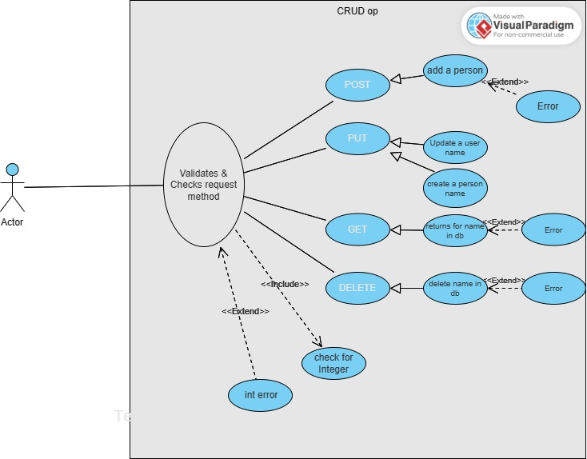

# Task Two:  CRUD Operation

This is a simple REST API capable of CRUD operations on a "person" resource, interfacing with any relational Database.

## Description

This is a basic REST API designed for CRUD operations on a "person" resource. It's notable for its versatility as it can interface with any relational database, providing a consistent means to Create, Read, Update, and Delete person records. The API adheres to RESTful principles, utilizing HTTP methods to interact with the resource efficiently. This simplicity and adaptability make it a practical choice for developers seeking a standardized solution for managing person-related data across different database systems.

## Table of Contents

- [Installation](#installation)

- [Features](#features)
- [Limitations](#limitations)
- [Documentation](#Documentation)
- [Use case](#usecase)
- [Url](#url)

## Installation

>Clone this repository to your local machine.

>Navigate to the project directory: cd TaskTwo.

> Run "python -m venv env" to create a virtual Environment.

> Run "env/Scripts/activate" to activate virtual Enviroment.

>Run "pip install -r requirements.txt" to install project dependencies.

>Run "flask run" in terminal to start the development server.

>Open http://localhost:5000 in a web browser to view the project.

## Features

* The GET request necessitates a user_id parameter. Its purpose is to retrieve a person from the database if a matching record exists.
* This POST request accepts JSON data, including corresponding values, and utilizes this information to create a new entry for a person in the database.
* The PUT request mandates a user_id and receives JSON data for updating a person's information. If the specified user_id does not exist in the database, throws an error.
* This DELETE request necessitates a 'user_id,' and if a matching person exists in the database, it proceeds to delete that individual.
## Limitations
* No support for Authentication and Authorization.
* No support for pagination.
* No Support for filter.
* No Support for sorting.

## Documentation

>

## UseCase

## url
>  https://https-github-com-zoesamm-hng-restapi.onrender.com/
